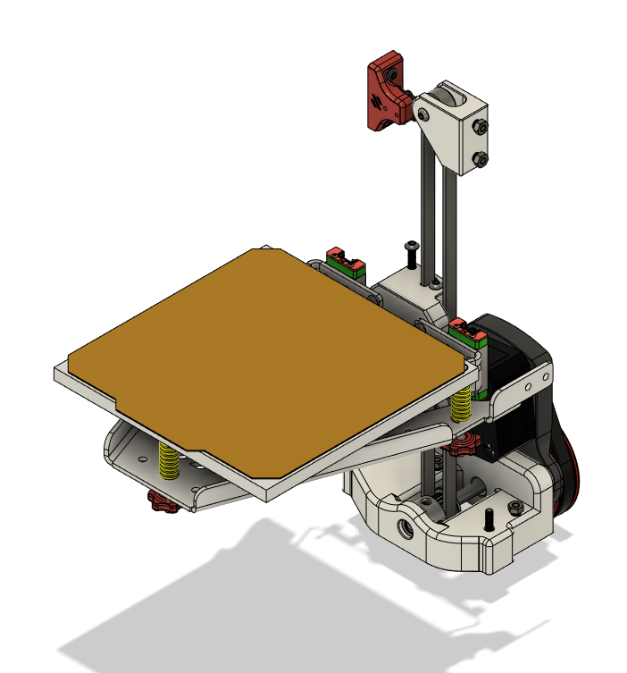
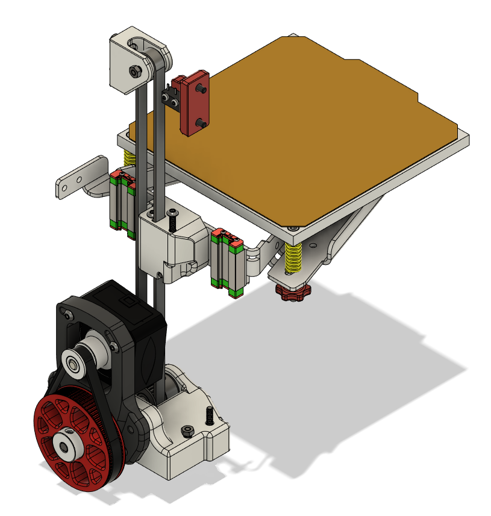
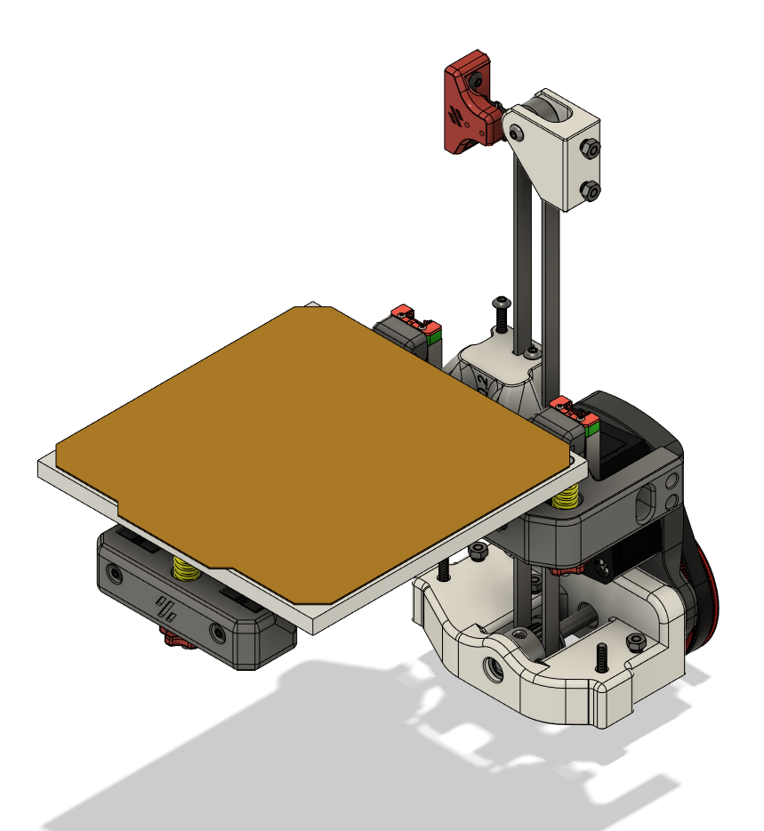
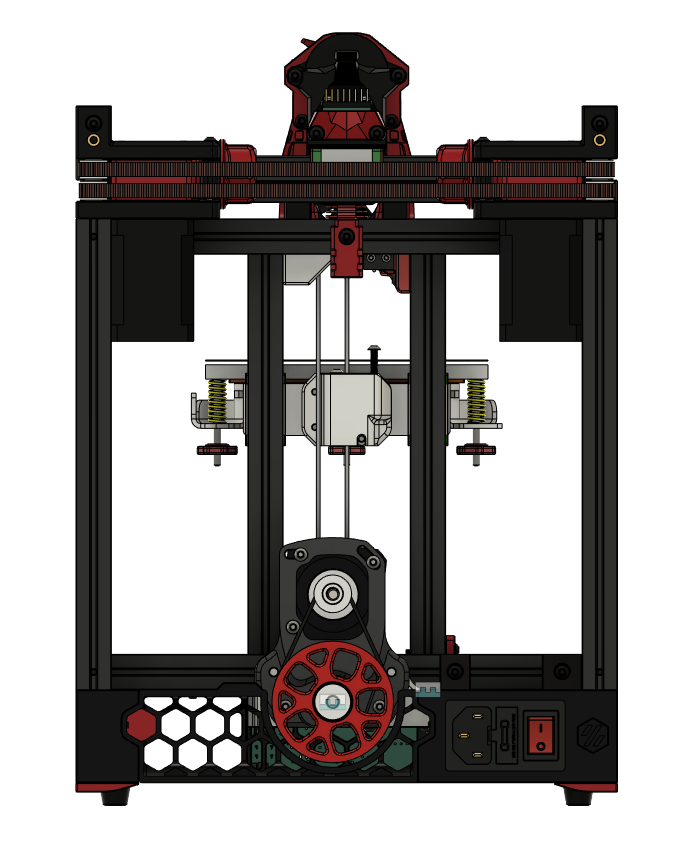
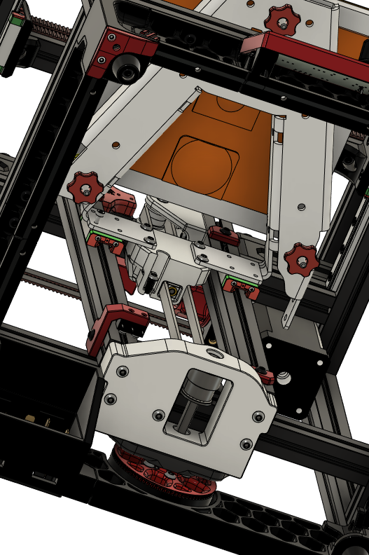

# V0 Belted Z
This is a new belted Z mod for the Voron Zero. It drops the Z drive below the bottom frame extrusion. This allows full range of motion for both stock (V0.0/V0.1/V0.2) and Kirigami setups. It has been tested with 5:1 gearing up to 300mm/s at 1000mm/s/s z accels and 200mm/s at 3000mm/s/s with an OMC-17HS08-1004S motor set to run_current: 0.5.

If you are installing fresh you will need to install the motor plate after installing the rear panel (the rest of the Z drive can be installed before).  You will also need to install the bedmount prior to mounting the back panel for the stock bed setups as they bolt from the back.  For the Kirigami the whole thing can be installed without removing the panel.

For the Z Drive itself, you will need three F695 bearings, a 200mm GT2 belt loop, and a 5mm OD by 75mm long shaft with flats for pulleys.  Longer shafts will also work (I am using a 100mm currently because I was too lazy to cut it shorted) as long as you set the end flush with the pulley in the 80 tooth, but you'll need to restrain cables to ensure they don't get near the shaft.

For the upper idler there are two models, one that can use F695 bearings and one for F623 bearings. I highly recommend using F623 bearings as the belt alignment will be a little bit better and if you're building a V0 you probably have two extras.

For bolt/nut/heatset counts they should all be in place in the CAD, each configuration has slight differences.

Kirigami Bed

Stock Bed

V0.2 Compatibility

