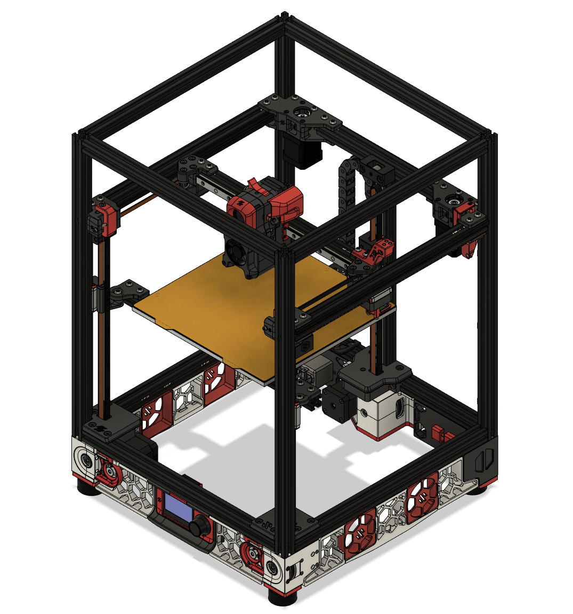

This is a belted Z mod candidate for the Voron Trident.  It use three modified V2.4 Z drives in place of the integrated leadscrew steppers for Z motion.  

Parts are currently designed for 9mm belts, but 6mm belts could be used by swapping to a 6mm pulley and adding extra spacers around the idler bearings.

Check motor datasheets and try to get Z motors that have at least 0.2 mNm of detent torque, most stepper motors that are at least 48mm long will have enough.  250mm builds with beds over 8mm thick, 300mm builds with beds over 6mm thick, and all 350mm builds are not recommended as the Z motors will likely not have a high enough detent torque to hold the bed on power off.  This can cause the bed to drop which can have the same effect as spinning steppers by hand, a charge will be sent back to stepper drivers and controller board which can fry components.

